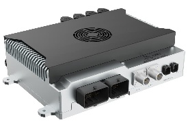
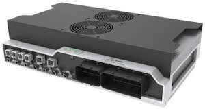
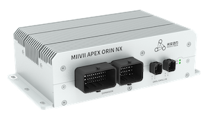

# MiiVii GMSL Camera

MiiVii GMSL Camera demo is an application software running under ROS2 environment. It depends on MiiVii low level GMSL SDK, and can be run on MiiVii device.
It publish fully synchronized image topics, and color format process is accelerated by hardware, which makes the node cost very limited CPU resource. Also, various camera vendors are supported.

Platform:

| Platform      | Main Chip     | Appearance     |
| ---------- | :-----------:  | :-----------:  |
| MIIVII APEX AD10    | Orin |       |
| MIIVII APEX DUAL ORIN    | Orin |       |
| MIIVII APEX ORIN NX   | Orin NX |       |


## MiiVii GMSL ROS2 User Guide

The MiiVii GMSL Camera contains only one ROS2 package miivii_gmsl_ros for now.

### Compile
Clone the repository and build:
```
    mkdir -p ~/catkin_ws/src & cd ~/catkin_ws/src
    git clone https://github.com/MiiViiDynamics/miivii_gmsl_camera
    source /opt/ros/humble/setup.bash
    colcon build
```

### Run ROS Demo and Display Camera by rviz
Open 2 terminals, launch miivii_gmsl_ros, rviz.

#### 1 camera connected, 1280x720
```
    ros2 launch miivii_gmsl_camera single.launch
```

You can check the image topic in rviz.


### Configuration

MiiVii GMSL Solution provides a configurable synchronize solution, which can be used to configure camera framerate at hardware level.
1. In launch file, change fps parameter and launch. This will change the low level trigger signal, change the camera shutter at hardware level.

## Contact
For technology issue, please file bugs on github directly.
For busniess contact, you can either visit our [taobao shop](https://shop324175547.taobao.com/?spm=a230r.7195193.1997079397.2.3154636cYGG7Vj)
, or mail to bd#miivii.com
